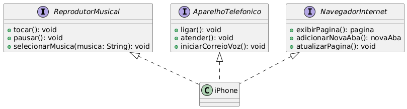

## 📘 O que é UML?

**UML (Unified Modeling Language)** é uma linguagem de modelagem visual utilizada para representar a estrutura e o comportamento de sistemas de software. Ela facilita a compreensão do sistema, promovendo uma comunicação mais clara entre desenvolvedores, analistas e outros envolvidos no projeto.

---

## 🧩 Diagrama UML deste projeto

O diagrama abaixo ilustra a estrutura de uma classe chamada `iPhone`, que implementa três interfaces distintas:

- **ReprodutorMusical**: Define ações relacionadas à reprodução de música, como:
  - `tocar()`
  - `pausar()`
  - `selecionarMusica(musica: String)`

- **AparelhoTelefonico**: Contém funcionalidades telefônicas:
  - `ligar()`
  - `atender()`
  - `iniciarCorreioVoz()`

- **NavegadorInternet**: Interface para ações de navegação web:
  - `exibirPagina()`
  - `adicionarNovaAba()`
  - `atualizarPagina()`

A classe `iPhone` implementa todas essas interfaces, refletindo suas capacidades multifuncionais como smartphone.

---

## 📷 Diagrama UML

> O diagrama foi gerado a partir do código UML usando [PlantUML](https://plantuml.com/).

